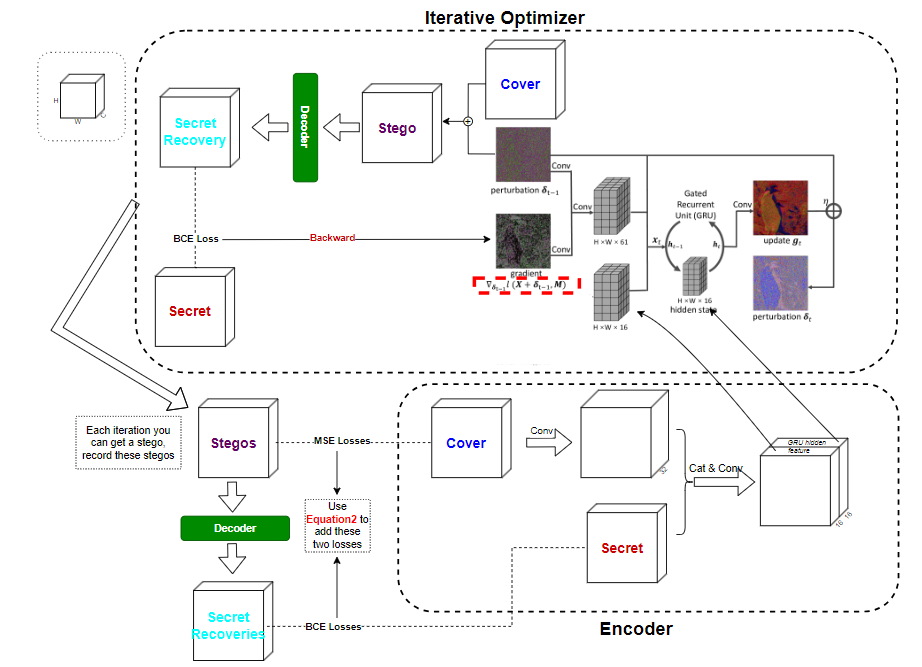
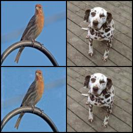

# [==> jump to official code of LISO](https://github.com/cxy1997/LISO)



## an unofficial `LISO` implement

# this `LISO` can hide a ``Binary secret`` or a ``RGB secret``

### there is no `Critic` module in this `LISO`

## requirements

```text
pandas==2.2.2
Pillow==10.4.0
pytorch_lightning==1.5.0
torch==2.3.1+cu121
torchmetrics==1.4.1
torchvision==0.18.1+cu121
tensorboard=2.17.1
```

## Usage

### inference
Run  `python hide.py` to use the pretrained weights([image](./lightning_logs/version_2/checkpoints/epoch=99-step=39999.ckpt), [binary](./lightning_logs/version_3/checkpoints/epoch=99-step=39999.ckpt))

Or
```python
from hide import inference

inference("<ckpt_path>", cover_path="<cover_path>", secret_path="<secret_path>")
```
result saves at `./result.jpg` by default

### training

1. provide **2 ``csv`` file** (one for train, another for valid) that **contains ``path`` column**, with the content being the **absolute path of each image
   **. [See Example](data/train.csv). 1000 images is enough.
2.

```python
import pytorch_lightning as pl

from model import LISO, SECRET_TYPE
from util.data.datamodule import LISODataModule

if __name__ == '__main__':
    hiding_type: SECRET_TYPE = "binary"  # can be `binary` or `image`
    cover_size = (3, 128, 128)  # cover H,W and secret H,W must be the same
    secret_size = (3, 128, 128)  # means 3bpp capacity if `binary`, or be a RBG image if `image`
    iters = 15  # iter times of the iterative optimizer
    hidden_ch = 32  # a hyper param that controls the hidden channels
    eta = 1.0  # the ``η`` in ``algorithm1`` and ``figure2`` in the paper
    gamma = 0.8  # the ``γ`` in ``equation2``, it's a decay factor

    lr = 1e-4

    # provide the data csv
    train_csv_path = "<train>.csv"
    val_csv_path = "<valid>.csv"

    batch_size = 2
    num_workers = 4

    # initial dataloader
    data_module = LISODataModule(
        train_csv_path=train_csv_path,
        val_csv_path=val_csv_path,
        cover_size=cover_size,
        secret_size=secret_size,
        secret_type=hiding_type,
        batch_size=batch_size,
        num_workers=num_workers,

        train_limit=800,  # 800 is enough
        val_limit=200
    )

    # LISO
    model = LISO(
        cover_size=cover_size,
        secret_size=secret_size,
        secret_type=hiding_type,
        iters=iters,
        hidden_ch=hidden_ch,
        eta=eta,
        gamma=gamma,
        lr=lr,
    )

    # training
    trainer = pl.Trainer(
        gpus=1,
        log_every_n_steps=1,
        max_epochs=100
    )
    trainer.fit(model, data_module)
```

3. watch logs

```bash
tensorboard --logdir=lightning_logs
```

## Result

`binary`  
**cover/stego PSNR: 33.71dBm, secret error rate: 0%**  
_(in this pic, cover/stego psnr: 32.60, accuracy: 1.0)_  
  

`image`  
**cover/stego PSNR: 32.61dB, secret/secret-recovery PSNR: 33.52dB**  
_(in this pic, cover/stego psnr: 33.66, cover/stego ssim: 0.9035, secret/recovery psnr: 34.67, secret/recover ssim: 0.9545)_  


## More

Under the above configuration, `LISO` has only **152k** params  
You can train `LISO` in several hours  

